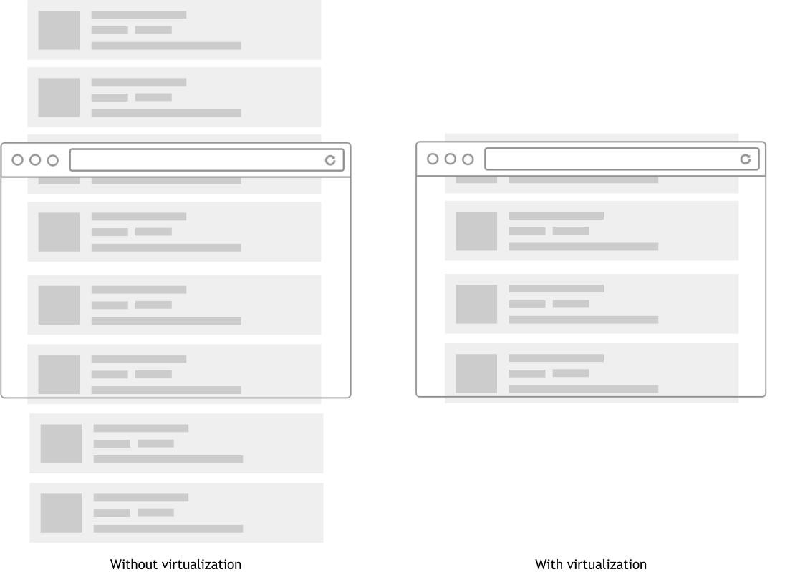

# Virtualization

Having numerous elements in the DOM slows down browsing a lot.
This is not related to React, which through an excellent rendering management manages to avoid drops in performance, but is due to the parsing of the DOM.

## Solution?

When a lot of data needs to be shown, it is advisable to adopt data paging or data virtualization.


[Image Source](https://medium.com/outsystems-engineering/virtualizing-the-virtual-dom-pushing-react-further-d76a16e5f209)

## Libraries
- [react-virtualized](https://github.com/bvaughn/react-virtualized)
- [react-window](https://github.com/bvaughn/react-window)

## Example
```jsx live=true title=react-window-example.js
/* import { FixedSizeList } from 'react-window' */

const Row = ({ index, style }) => (
  <div style={style}>Row {index}</div>
);
 
const Example = () => (
  <FixedSizeList 
    height={300}
    itemCount={1000}
    itemSize={35}
    width={400}
  >
    {Row}
  </FixedSizeList>
);

render(<Example />)
```

