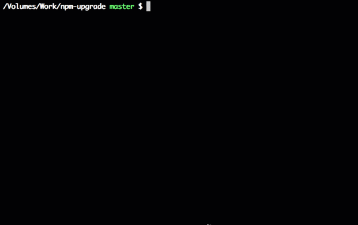

# Packages

Project dependencies need to be updated regularly. Keeping your packages up to date allows you to have a codebase with less bug risk and more features.
There are useful tools to update packages, taking into account the [Semantic version specification](https://semver.org/)

## npm-upgrade
`npm-upgrade` is an interactive CLI utility to easily update outdated NPM dependencies with changelogs inspection support

## Update

### Links
- [npm-upgrade](https://www.npmjs.com/package/npm-upgrade)

